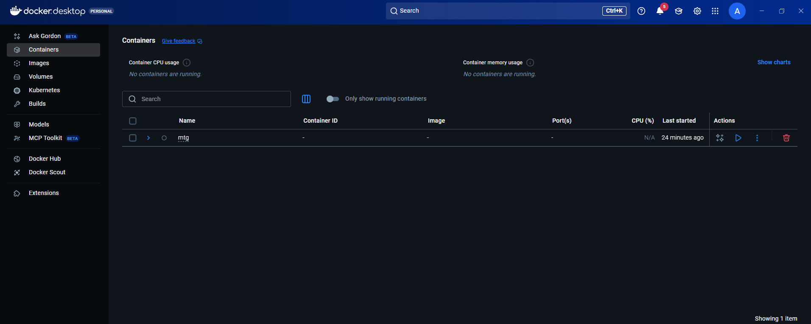
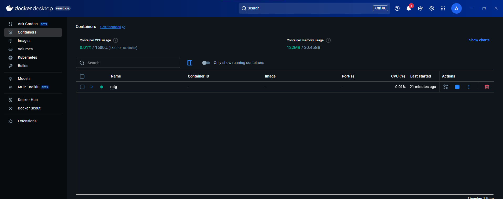
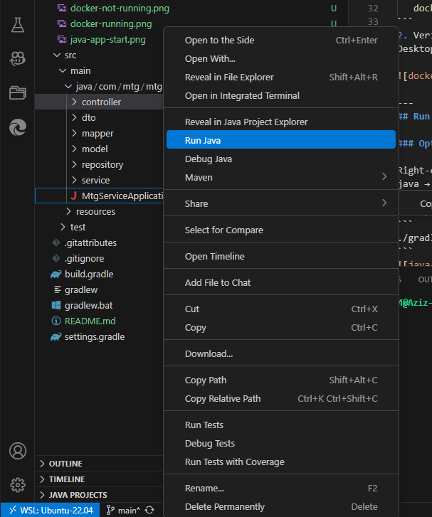
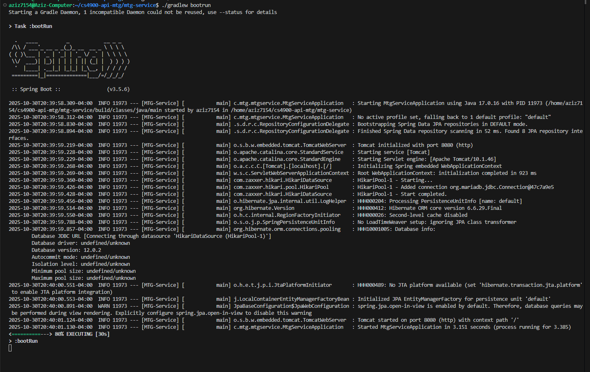
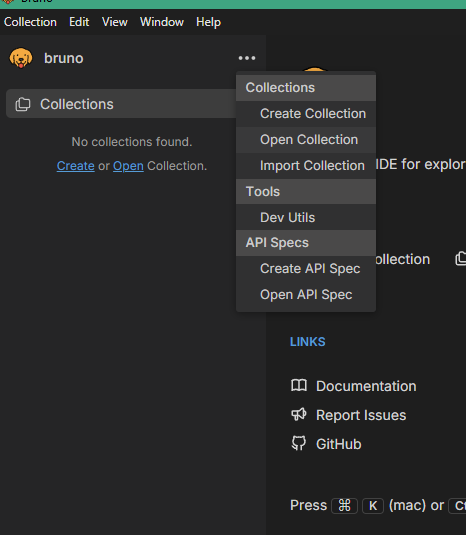
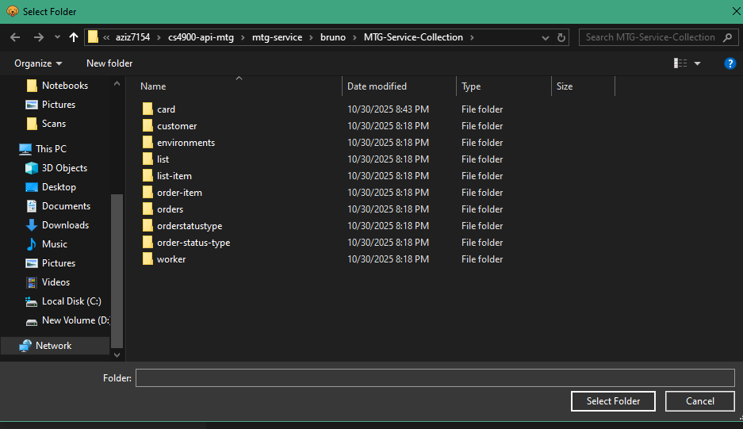
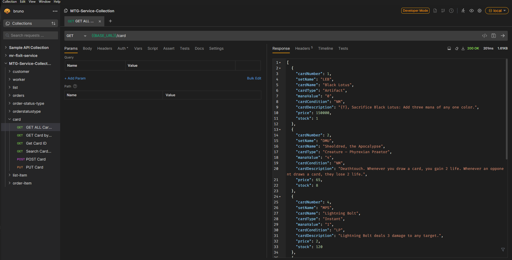

# MTG-Service API  
**Group Project – Homework 5 Catch Up / Verification**

---

## Purpose / Objectives
The purpose of this service is to provide a working REST API for the **Magic: The Gathering inventory and order management** system.  
This project demonstrates working **GET, POST, and PUT endpoints** for multiple entities (`Card`, `ListItem`, `OrderItem`, `OrderStatusType`, etc.) that connect to a MariaDB database container.

---

## Required Tools
| Tool | Purpose | Notes |
|------|----------|-------|
| **Java 17 +** | Run the Spring Boot 3.5 API | verify `java –version` |
| **Gradle 8 +** | build & run service | use `./gradlew bootRun` |
| **Docker Desktop** | host MariaDB container | make sure container `mtg` is running |
| **Bruno** | API testing tool | use the provided collection `/bruno/MTG-Service-Collection` |
| **VS Code + Java extensions** | IDE for development | Extension Pack for Java recommended |

---

## Database Setup

1. Open Docker Desktop → start container **`mtg`**  
   (compose file: `db/docker-compose.yml`)



   ```bash
   cd db
   docker compose up -d
```
2. Verify it’s running: the green dot appears next to mtg in Docker Desktop. Port mapping 3306 → localhost 3306.



---
## Run the Service

### Option 1 – VS Code

Right-click src/main/java/com/mtg/mtgservice/MtgServiceApplication.java → Run Java.



### Option 2 – Gradle CLI
```
./gradlew bootRun
```



---
When startup completes, the console shows:

Started MtgServiceApplication ... Tomcat started on port 8080

---
## Test with Bruno

1. Open Bruno and load the collection
```
bruno/MTG-Service-Collection
```




2. Set the environment to local

3. Run the API rquests for each entity



---
## Example Endpoints

### Card

| Method | Endpoint | Description |
|--------|-----------|--------------|
| GET | `/card` | Retrieve all cards |
| GET | `/card/:cardNumber/:setName` | Retrieve card by composite key |
| GET | `/card/search?q={text}` | Search by card name |
| POST | `/card` | Create a new card |
| PUT | `/card/{cardNumber}/{setName}` | Update an existing card |

### Example POST body:
```
{
  "cardNumber": 269,
  "setName": "ALP",
  "cardName": "Sol Ring",
  "cardType": "Artifact",
  "manaValue": "1",
  "cardCondition": "NM",
  "cardDescription": "{T}: Add {C}{C}.",
  "price": 2.50,
  "stock": 25
}
```
